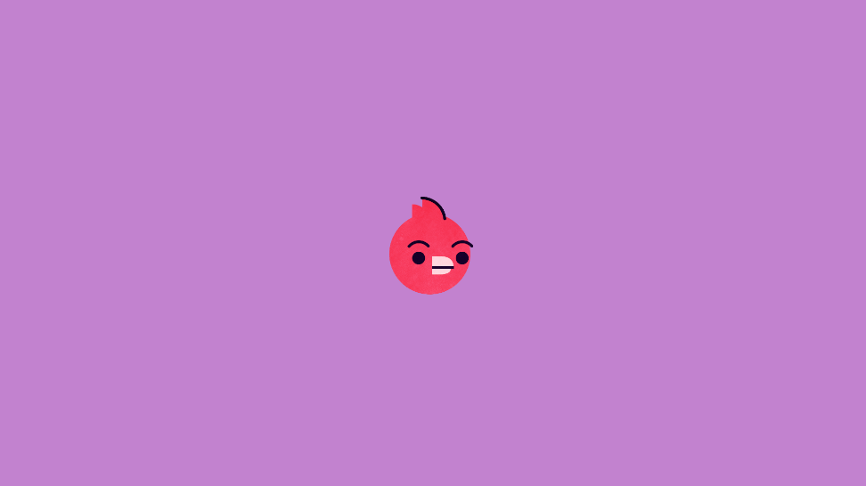

This is a simple Flappy Bird game created in Unity.

**Features:**

* Classic Flappy Bird gameplay
* Simple controls (tap to jump)
* Score tracking
* Game over screen

**How to Play:**

1. Download the Unity project.
2. Open the project in Unity.
3. Press play to start the game.
4. Tap the space to make the bird jump.

**Controls:**

* **Space:** Jump

**Credits:**

* **Game Development:** Vikas

**License:**

This project is licensed under the [License Name] license.

**Contact:**

vikasmaury225@gmail.com

**Enjoy the game!**
